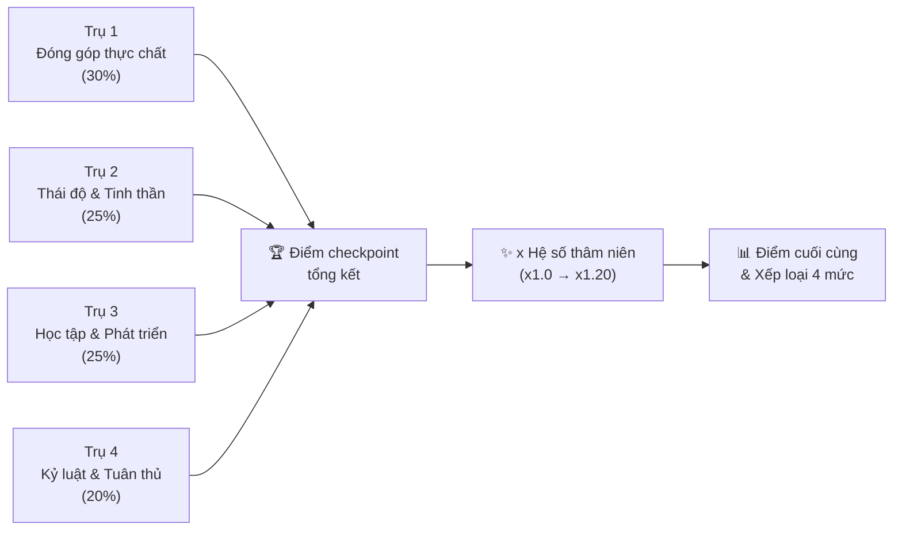
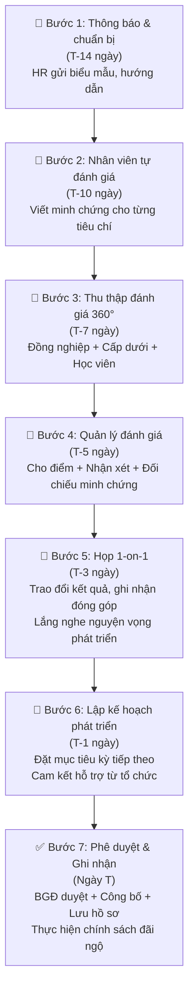

# Bộ Tiêu Chí Checkpoint Định Kỳ (6 Tháng/Lần) — Phiên Bản 3
**Lĩnh vực**: Giáo dục / Đào tạo  
**Phòng ban**: Phòng Đào tạo  
**Chu kỳ đánh giá**: 6 tháng/lần  
**Triết lý đánh giá**: Ưu tiên ghi nhận **kinh nghiệm gắn bó**, **đóng góp thực chất**, **thái độ tích cực**, và **tinh thần học tập phát triển**  
**Xếp loại**: 4 mức — Không đạt yêu cầu / Cần cố gắng / Đạt yêu cầu / Vượt yêu cầu

---

## Tổng Quan Cấu Trúc Đánh Giá

> [!IMPORTANT]
> **Nguyên tắc cốt lõi**: Điểm checkpoint = (Tổng điểm 4 trụ cột × trọng số) × **Hệ số thâm niên**. Nhân viên gắn bó lâu năm được cộng hệ số, đảm bảo kinh nghiệm và sự cống hiến được ghi nhận xứng đáng.

---

## Phần A – Bốn Trụ Cột Đánh Giá (Áp Dụng Toàn Bộ Nhân Viên)

### Trụ 1: Đóng Góp Thực Chất Cho Tổ Chức — Trọng số 30%

> Đây là trụ cột có trọng số **cao nhất**, phản ánh giá trị thực tế mà nhân viên mang lại.

| # | Tiêu chí | 1 – Yếu | 2 – Dưới TB | 3 – Đạt | 4 – Tốt | 5 – Xuất sắc |
|---|----------|---------|-------------|---------|---------|--------------|
| 1.1 | **Kết quả công việc cốt lõi** | Không hoàn thành nhiệm vụ chính, ảnh hưởng tiến độ chung | Hoàn thành < 60% mục tiêu, chất lượng chưa ổn định | Hoàn thành 60–79% mục tiêu, chất lượng chấp nhận được | Hoàn thành 80–95% mục tiêu, chất lượng tốt, ít phải chỉnh sửa | Hoàn thành > 95% mục tiêu, vượt kỳ vọng, tạo ra giá trị vượt trội |
| 1.2 | **Sáng kiến & cải tiến** | Không có bất kỳ đề xuất nào | Có ý tưởng nhưng không triển khai được | Đề xuất ≥ 1 sáng kiến khả thi, được ghi nhận | Sáng kiến được áp dụng, mang lại hiệu quả đo lường được | Sáng kiến tạo thay đổi tích cực ở quy mô phòng ban/tổ chức |
| 1.3 | **Đóng góp ngoài phạm vi** | Chỉ làm đúng nhiệm vụ được giao, không hỗ trợ ai | Thỉnh thoảng hỗ trợ khi được yêu cầu | Chủ động hỗ trợ đồng nghiệp/phòng ban khác khi cần | Thường xuyên đóng góp cho dự án liên phòng ban, được đồng nghiệp ghi nhận | Là người dẫn dắt các dự án liên phòng ban, mentor cho người khác |
| 1.4 | **Tác động đến học viên/khách hàng** | Nhận phản hồi tiêu cực từ học viên/đối tác | Phản hồi trung lập, không tạo ấn tượng | Phản hồi tích cực từ học viên/đối tác | Được học viên/đối tác đánh giá cao, có thư cảm ơn/khen ngợi | Tạo được ảnh hưởng tích cực rộng, góp phần nâng cao uy tín tổ chức |

**Minh chứng yêu cầu**: Báo cáo KPI/OKR, phản hồi từ học viên/đối tác, biên bản sáng kiến, email/tin nhắn ghi nhận từ đồng nghiệp.

---

### Trụ 2: Thái Độ & Tinh Thần Làm Việc — Trọng số 25%

> Thái độ quyết định 50% thành công. Đánh giá cả **cách làm việc** chứ không chỉ **kết quả**.

| # | Tiêu chí | 1 – Yếu | 2 – Dưới TB | 3 – Đạt | 4 – Tốt | 5 – Xuất sắc |
|---|----------|---------|-------------|---------|---------|--------------|
| 2.1 | **Tinh thần trách nhiệm** | Đùn đẩy, đổ lỗi, không nhận trách nhiệm | Thỉnh thoảng phải nhắc nhở mới hoàn thành | Có trách nhiệm với công việc được giao | Chủ động nhận trách nhiệm, tự giác giải quyết vấn đề | Dám nhận trách nhiệm trong tình huống khó, truyền cảm hứng cho người khác |
| 2.2 | **Tinh thần hợp tác & teamwork** | Gây mâu thuẫn, không hợp tác | Hợp tác thụ động, chỉ làm phần mình | Hợp tác tốt khi được phân công | Chủ động hỗ trợ, chia sẻ, tạo không khí tích cực trong nhóm | Là chất keo gắn kết đội nhóm, xây dựng văn hóa hợp tác |
| 2.3 | **Thái độ khi gặp khó khăn** | Bỏ cuộc, phàn nàn, tiêu cực | Lo lắng, cần người khác hỗ trợ nhiều | Bình tĩnh giải quyết, tìm cách khắc phục | Biến khó khăn thành cơ hội, rút kinh nghiệm cho lần sau | Dẫn dắt đội nhóm vượt qua khó khăn, duy trì tinh thần tích cực |
| 2.4 | **Tôn trọng & giao tiếp** | Giao tiếp thiếu tôn trọng, gây ảnh hưởng xấu | Giao tiếp đôi khi chưa khéo léo | Giao tiếp lịch sự, tôn trọng đồng nghiệp & cấp trên | Giao tiếp khéo léo, xây dựng, lắng nghe tích cực | Là hình mẫu giao tiếp trong tổ chức, giải quyết xung đột hiệu quả |
| 2.5 | **Chủ động & proactive** | Thụ động chờ việc, phải nhắc nhiều lần | Làm theo chỉ đạo, ít khi tự đề xuất | Chủ động hoàn thành việc được giao, thỉnh thoảng đề xuất | Thường xuyên chủ động tìm việc, đề xuất giải pháp trước khi được yêu cầu | Luôn đi trước, dự đoán vấn đề, chủ động đề xuất hướng phát triển |

**Minh chứng yêu cầu**: Đánh giá 360° (quản lý, đồng nghiệp, cấp dưới), ghi nhận trong các cuộc họp, phản hồi từ học viên.

> **Từ Điển Minh Chứng Đi Kèm (Khảo sát Đánh giá 360° đối với Trụ 2):**
> - **Mức 3 (Đạt)**: Đạt ≥ 60% tỷ lệ đồng thuận tích cực từ đồng nghiệp/cấp dưới.
> - **Mức 4 (Tốt)**: Đạt ≥ 80% tỷ lệ đồng thuận tích cực từ đồng nghiệp/cấp dưới.
> - **Mức 5 (Xuất sắc)**: Đạt ≥ 90% tỷ lệ đồng thuận tích cực từ đồng nghiệp/cấp dưới **VÀ** có minh chứng cụ thể (email, tin nhắn, sự việc cụ thể) về việc giúp đỡ/lan tỏa năng lượng tích cực cho tập thể.

---

### Trụ 3: Tinh Thần Học Tập & Phát Triển — Trọng số 25%

> Trong ngành Giáo dục, **người dạy phải là người học trước**. Tinh thần cầu tiến là yếu tố sống còn.

| # | Tiêu chí | 1 – Yếu | 2 – Dưới TB | 3 – Đạt | 4 – Tốt | 5 – Xuất sắc |
|---|----------|---------|-------------|---------|---------|--------------|
| 3.1 | **Tự học & cập nhật kiến thức** | Không có hoạt động học tập nào trong 6 tháng | Học khi được yêu cầu, không tự giác | Hoàn thành đào tạo bắt buộc + tự học ≥ 1 nội dung mới | Chủ động học ≥ 2 kỹ năng/kiến thức mới, có chứng chỉ hoặc minh chứng rõ ràng | Trở thành chuyên gia nội bộ ở ≥ 1 lĩnh vực, được mời chia sẻ/đào tạo lại |
| 3.2 | **Chia sẻ kiến thức** | Không chia sẻ gì cho đồng nghiệp | Chia sẻ khi được yêu cầu | Chủ động chia sẻ ≥ 1 lần (họp nhóm, email, tài liệu nội bộ) | Tổ chức ≥ 1 buổi chia sẻ/workshop nội bộ, viết tài liệu hướng dẫn | Xây dựng hệ thống chia sẻ kiến thức, mentor cho ≥ 2 đồng nghiệp |
| 3.3 | **Áp dụng kiến thức mới vào công việc** | Học nhưng không áp dụng được | Thử áp dụng nhưng chưa hiệu quả | Áp dụng ≥ 1 kiến thức/kỹ năng mới vào công việc thực tế | Kiến thức mới cải thiện hiệu suất công việc có thể đo lường | Tạo ra quy trình/phương pháp mới từ kiến thức đã học, lan tỏa ra nhóm/phòng ban |
| 3.4 | **Tiếp nhận phản hồi & cải thiện** | Phản ứng tiêu cực với phản hồi, không thay đổi | Lắng nghe nhưng không thay đổi hành vi | Tiếp nhận phản hồi và cải thiện được ≥ 1 điểm yếu | Chủ động xin phản hồi, cải thiện rõ rệt so với checkpoint trước | Biến phản hồi thành kế hoạch phát triển cá nhân, tiến bộ vượt bậc |
| 3.5 | **Tham gia cộng đồng chuyên môn** | Không tham gia hoạt động chuyên môn nào bên ngoài | Theo dõi thụ động (đọc tin, xem video) | Tham gia ≥ 1 hội thảo/webinar/cộng đồng chuyên môn | Tham gia tích cực ≥ 2 hoạt động, mang kiến thức về chia sẻ cho tổ chức | Là diễn giả/thành viên ban tổ chức sự kiện chuyên ngành, nâng cao uy tín tổ chức |

**Minh chứng yêu cầu**: Chứng chỉ, bài viết/tài liệu đã chia sẻ, báo cáo tham dự hội thảo, ghi nhận từ quản lý về sự tiến bộ.

---

### Trụ 4: Kỷ Luật & Tuân Thủ — Trọng số 20%

> Tiêu chí nền tảng. Không đạt các mục đánh dấu ⛔ sẽ bị **Không đạt checkpoint** bất kể điểm khác.

| # | Tiêu chí | 1 – Yếu | 2 – Dưới TB | 3 – Đạt | 4 – Tốt | 5 – Xuất sắc |
|---|----------|---------|-------------|---------|---------|--------------|
| 4.1 ⛔ | **Chấm công & giờ giấc** | > 5 lần đi muộn/về sớm không phép | 4–5 lần | 1–3 lần | 0 lần, luôn đúng giờ | 0 lần + thường xuyên đến sớm, sẵn sàng hỗ trợ ngoài giờ khi cần |
| 4.2 ⛔ | **Không vi phạm nội quy nghiêm trọng** | Bị kỷ luật từ mức cảnh cáo trở lên | Bị nhắc nhở bằng văn bản ≥ 2 lần | Bị nhắc nhở ≤ 1 lần, lỗi nhẹ | Không vi phạm | Không vi phạm + nhắc nhở, hỗ trợ đồng nghiệp tuân thủ |
| 4.3 | **Nghỉ phép đúng quy trình** | Nghỉ không phép nhiều lần | Hay báo muộn, quy trình không đầy đủ | Tuân thủ quy trình nghỉ phép | Luôn báo trước, bàn giao công việc rõ ràng | Báo trước + chủ động sắp xếp người thay thế, không ảnh hưởng công việc |
| 4.4 | **Bảo mật thông tin** | Vi phạm bảo mật nghiêm trọng | Vi phạm nhẹ, cần nhắc nhở | Tuân thủ đầy đủ | Tuân thủ + nhắc nhở đồng nghiệp | Góp phần xây dựng quy trình bảo mật tốt hơn |

---

## Phần B – Hệ Số Thâm Niên (Ghi Nhận Kinh Nghiệm & Gắn Bó)

> [!IMPORTANT]
> Hệ số thâm niên là **cơ chế thưởng** cho sự gắn bó lâu dài. Điểm cuối cùng = Điểm trung bình có trọng số × Hệ số thâm niên.

| Thâm niên tại công ty | Hệ số | Ý nghĩa |
|---|---|---|
| **< 1 năm** | x1.00 | Mới gia nhập, đánh giá cơ bản |
| **1 – 2 năm** | x1.05 | Đã qua giai đoạn thích nghi, bắt đầu đóng góp ổn định |
| **3 – 5 năm** | x1.10 | Nhân sự nòng cốt, hiểu sâu văn hóa & quy trình |
| **5 – 8 năm** | x1.15 | Nhân sự cốt cán, có ảnh hưởng lớn đến tổ chức |
| **> 8 năm** | x1.20 | Trụ cột tổ chức, ghi nhận đặc biệt sự cống hiến |

### Điều kiện bổ sung cho hệ số thâm niên:

> [!WARNING]
> Hệ số thâm niên **chỉ được áp dụng** khi nhân viên đạt tối thiểu mức **"Đạt" (≥ 3.0 điểm)** ở Trụ 2 (Thái độ), Trụ 3 (Học tập) **VÀ** Trụ 1 (Đóng góp) (hoặc điểm Phần C đối với bộ phận chuyên môn). Không thể tăng lương cho một nhân sự có chuyên môn dưới chuẩn chỉ vì họ lâu năm và có thái độ tốt.

---

## Phần C – Tiêu Chí Riêng Cho Nhân Viên Phòng Đào Tạo

> Nhân viên Phòng Đào tạo được đánh giá theo cả Phần A (60%) + Phần C (40%). Hệ số thâm niên áp dụng lên tổng.

| # | Tiêu chí | 1 – Yếu | 2 – Dưới TB | 3 – Đạt | 4 – Tốt | 5 – Xuất sắc |
|---|----------|---------|-------------|---------|---------|--------------|
| C.1 | **Chất lượng chương trình đào tạo** | Nội dung lạc hậu, học viên phản hồi tiêu cực | Nội dung cơ bản, chưa cập nhật xu hướng | Nội dung đầy đủ, đáp ứng yêu cầu | Nội dung chất lượng cao, có yếu tố sáng tạo, học viên phản hồi tốt (≥ 4.0/5.0) | Tạo ra chương trình đột phá, được đánh giá xuất sắc, có thể nhân rộng |
| C.2 | **Tỷ lệ hiệu quả sau đào tạo** | < 40% học viên áp dụng được | 40–59% | 60–74% | 75–89% | ≥ 90% học viên áp dụng kiến thức vào công việc (khảo sát sau 1–3 tháng) |
| C.3 | **Phát triển đội ngũ giảng viên nội bộ** | Không phát triển thêm giảng viên nào | Hỗ trợ nhưng chưa có kết quả | Phát triển ≥ 1 giảng viên nội bộ mới | Xây dựng chương trình TOT, phát triển ≥ 2 giảng viên | Tạo hệ thống đào tạo giảng viên bài bản, giảng viên mới có thể tự vận hành |
| C.4 | **Đổi mới phương pháp đào tạo** | Không thay đổi, sử dụng phương pháp cũ 100% | Biết xu hướng mới nhưng chưa áp dụng | Thử nghiệm ≥ 1 phương pháp/công cụ mới | Triển khai thành công ≥ 1 phương pháp mới (e-learning, gamification, microlearning...) | Tạo mô hình đào tạo mới, được tổ chức ghi nhận, có thể trình bày tại hội nghị |
| C.5 | **Gắn kết đào tạo với chiến lược tổ chức** | Đào tạo không liên quan đến mục tiêu tổ chức | Có liên quan nhưng chưa rõ kết nối | Chương trình đào tạo bám sát nhu cầu phòng ban | Đào tạo trực tiếp giải quyết gaps năng lực theo chiến lược | Tham mưu cho Ban Giám đốc về chiến lược phát triển nhân lực, đào tạo dẫn dắt thay đổi |

---

## Phần D – Bảng Phân Loại Kết Quả & Chính Sách Đãi Ngộ (4 Mức)

### Công thức tính điểm:

$$\text{Điểm cuối cùng} = \left(\sum_{i=1}^{4} \text{Điểm trụ}_i \times \text{Trọng số}_i\right) \times \text{Hệ số thâm niên}$$

> Với NV Phòng Đào tạo: Điểm tổng hợp trước hệ số = (Điểm Phần A × 60%) + (Điểm Phần C × 40%)

### Bảng xếp loại:

| Xếp loại | Điểm cuối cùng | Đề xuất đãi ngộ | Hành động kèm theo |
|---|---|---|---|
| 🟢 **Vượt yêu cầu** | ≥ 4.0 | **Tăng lương 2 – 3 triệu đồng** | Ưu tiên thăng tiến, bổ nhiệm, cử đi đào tạo nâng cao, ghi nhận toàn tổ chức |
| 🔵 **Đạt yêu cầu** | 3.0 – 3.99 | **Tăng lương 1 – 2 triệu đồng** | Tiếp tục phát triển, lập kế hoạch nâng cao năng lực |
| 🟡 **Cần cố gắng** | 2.0 – 2.99 | **Giảm lương / Giữ nguyên / Tăng nhẹ dưới 1 triệu đồng** | Lập kế hoạch cải thiện (PIP), review lại sau 3 tháng, cảnh báo chính thức |
| 🔴 **Không đạt yêu cầu** | < 2.0 hoặc vi phạm ⛔ | **Giảm lương hoặc chấm dứt hợp đồng** | Xem xét kỷ luật, chuyển vị trí, hoặc chấm dứt HĐLĐ |

---

## Phần E – Các Case Minh Họa (Phòng Đào Tạo)

> [!NOTE]
> 4 case dưới đây minh họa cách tính điểm cho NV Phòng Đào tạo. Công thức: **(Phần A × 60% + Phần C × 40%) × Hệ số thâm niên.**

---

### 🟢 Case 1: VƯỢT YÊU CẦU — Chị Lan, CV Đào tạo, 6 năm

> Gắn bó lâu năm, thiết kế chương trình sáng tạo, triển khai gamification + microlearning, mentor 3 giảng viên mới, tham mưu chiến lược nhân lực cho BGĐ, lấy chứng chỉ Instructional Design.

| Hạng mục | Điểm | Ghi chú |
|---|---|---|
| Phần A – Trụ 1: Đóng góp (30%) | 4.50 | KPI vượt 95%, sáng kiến blended learning |
| Phần A – Trụ 2: Thái độ (25%) | 4.60 | ✅ ≥ 3.0 — Chủ động, truyền cảm hứng |
| Phần A – Trụ 3: Học tập (25%) | 4.40 | ✅ ≥ 3.0 — Chứng chỉ mới, tổ chức 2 workshop |
| Phần A – Trụ 4: Kỷ luật (20%) | 4.80 | 0 vi phạm |
| **TB Phần A (có trọng số)** | **4.56** | |
| **Phần C – Tiêu chí Đào tạo** | **4.80** | Hài lòng 4.7/5, TOT, đổi mới phương pháp |
| Tổng (A×60% + C×40%) | **4.66** | |
| Hệ số thâm niên (5–8 năm) | **× 1.15 ✅** | Thái độ & Học tập đều ≥ 3.0 |
| **ĐIỂM CUỐI CÙNG** | **5.35** | 🟢 **VƯỢT YÊU CẦU** |

> **→ Tăng lương 2–3 triệu** + Ưu tiên thăng tiến + Cử đào tạo nâng cao.

---

### 🔵 Case 2: ĐẠT YÊU CẦU — Bạn Thảo, CV Đào tạo, 10 tháng

> Mới vào nhưng chủ động, học nhanh, lấy chứng chỉ Facilitation, thử nghiệm công cụ khảo sát online, học viên hài lòng 3.8/5, xin feedback thường xuyên.

| Hạng mục | Điểm | Ghi chú |
|---|---|---|
| Phần A – Trụ 1: Đóng góp (30%) | 3.50 | KPI 85%, đề xuất cải tiến khóa onboarding |
| Phần A – Trụ 2: Thái độ (25%) | 4.20 | ✅ ≥ 3.0 — Hòa nhập nhanh, rất chủ động |
| Phần A – Trụ 3: Học tập (25%) | 4.00 | ✅ ≥ 3.0 — 2 khóa e-learning + chứng chỉ |
| Phần A – Trụ 4: Kỷ luật (20%) | 4.00 | 0 lần muộn |
| **TB Phần A (có trọng số)** | **3.90** | |
| **Phần C – Tiêu chí Đào tạo** | **3.00** | Đạt ở mức cơ bản, đang tiến bộ |
| Tổng (A×60% + C×40%) | **3.54** | |
| Hệ số thâm niên (< 1 năm) | **× 1.00** | Chưa đủ thâm niên |
| **ĐIỂM CUỐI CÙNG** | **3.54** | 🔵 **ĐẠT YÊU CẦU** |

> **→ Tăng lương 1–2 triệu** + Lập kế hoạch nâng cao chuyên môn. Nếu duy trì, kỳ sau với hệ số x1.05 sẽ tiệm cận Vượt yêu cầu.

---

### 🟡 Case 3: CẦN CỐ GẮNG — Anh Phong, CV Đào tạo, 4 năm

> Từng tốt nhưng 1 năm gần đây chững lại. Nội dung đào tạo bắt đầu cũ, biết e-learning nhưng chưa áp dụng, thái độ ổn nhưng thiếu chủ động, ít tự học.

| Hạng mục | Điểm | Ghi chú |
|---|---|---|
| Phần A – Trụ 1: Đóng góp (30%) | 2.25 | KPI chỉ 65%, không sáng kiến |
| Phần A – Trụ 2: Thái độ (25%) | 2.80 | ❌ < 3.0 — Hợp tác thụ động, ít đề xuất |
| Phần A – Trụ 3: Học tập (25%) | 2.60 | ❌ < 3.0 — Chỉ hoàn thành bắt buộc |
| Phần A – Trụ 4: Kỷ luật (20%) | 3.50 | 2 lần muộn, không vi phạm lớn |
| **TB Phần A (có trọng số)** | **2.73** | |
| **Phần C – Tiêu chí Đào tạo** | **2.00** | Nội dung cũ, hài lòng 3.2/5, chưa áp dụng e-learning |
| Tổng (A×60% + C×40%) | **2.44** | |
| Hệ số thâm niên (3–5 năm) | **× 1.00 ❌** | BỊ KHÓA — Thái độ, Học tập & Phần C đều < 3.0 |
| **ĐIỂM CUỐI CÙNG** | **2.44** | 🟡 **CẦN CỐ GẮNG** |

> **→ Giữ nguyên lương hoặc tăng nhẹ dưới 1 triệu** + PIP 3 tháng. Nếu nâng Thái độ, Học tập và điểm chuyên môn (Phần C) lên tối thiểu 3.0, hệ số x1.10 sẽ mở khóa → có thể vươn lên Đạt yêu cầu.

---

### 🔴 Case 4: KHÔNG ĐẠT YÊU CẦU — Anh Tuấn, CV Đào tạo, 5 năm

> Từng giỏi nhưng 2 năm sa sút. Slide cũ 3 năm, từ chối e-learning, từ chối mentor, hay phàn nàn, không tự học, phản ứng tiêu cực khi nhận feedback, 4 lần muộn.

| Hạng mục | Điểm | Ghi chú |
|---|---|---|
| Phần A – Trụ 1: Đóng góp (30%) | 1.50 | KPI 55%, không sáng kiến, từ chối hỗ trợ |
| Phần A – Trụ 2: Thái độ (25%) | 2.00 | ❌ < 3.0 — Phàn nàn, đùn đẩy, thụ động |
| Phần A – Trụ 3: Học tập (25%) | 1.20 | ❌ < 3.0 — Không học gì, không chia sẻ |
| Phần A – Trụ 4: Kỷ luật (20%) | 2.50 | 4 lần muộn, bị nhắc nhở bằng VB |
| **TB Phần A (có trọng số)** | **1.75** | |
| **Phần C – Tiêu chí Đào tạo** | **1.00** | Nội dung cũ 100%, 35% HV áp dụng, từ chối công cụ mới |
| Tổng (A×60% + C×40%) | **1.45** | |
| Hệ số thâm niên (5–8 năm) | **× 1.00 ❌** | BỊ KHÓA — Vi phạm toàn bộ điều kiện |
| **ĐIỂM CUỐI CÙNG** | **1.45** | 🔴 **KHÔNG ĐẠT YÊU CẦU** |

> **→ Giảm lương hoặc chấm dứt hợp đồng.** Nếu cho cơ hội cuối: PIP 3 tháng, cam kết cập nhật ≥ 50% nội dung + học 1 công cụ e-learning. Vẫn dưới 2.0 kỳ sau → chấm dứt HĐLĐ.

---

### 📊 Bảng Tổng Hợp

| Case | Họ tên | Thâm niên | Phần A | Phần C | Hệ số TN | Điểm cuối | Xếp loại | Đề xuất lương |
|---|---|---|---|---|---|---|---|---|
| 1 | Chị Lan | 6 năm | 4.56 | 4.80 | × 1.15 ✅ | **5.35** | 🟢 Vượt YC | **+2 đến 3 triệu** |
| 2 | Bạn Thảo | 10 tháng | 3.90 | 3.00 | × 1.00 | **3.54** | 🔵 Đạt YC | **+1 đến 2 triệu** |
| 3 | Anh Phong | 4 năm | 2.73 | 2.00 | × 1.00 ❌ | **2.44** | 🟡 Cần cố gắng | **Giữ nguyên / +<1 triệu** |
| 4 | Anh Tuấn | 5 năm | 1.75 | 1.00 | × 1.00 ❌ | **1.45** | 🔴 Không đạt | **Giảm / Chấm dứt HĐ** |

> [!IMPORTANT]
> **Bạn Thảo** (10 tháng) xếp cao hơn **Anh Phong** (4 năm) và **Anh Tuấn** (5 năm) → **thái độ + học tập > thâm niên suông**.

---

## Phần F – Quy Trình Thực Hiện Checkpoint

> [!TIP]
> **Lưu ý quan trọng khi triển khai:**
> - **Buổi họp 1-on-1 (Bước 5)** nên dành ≥ 50% thời gian để **ghi nhận đóng góp** và **lắng nghe nguyện vọng** của nhân viên, chứ không chỉ tập trung vào điểm yếu.
> - **Nhân viên lâu năm** nên được mời chia sẻ kinh nghiệm trong buổi calibration (hiệu chỉnh), giúp quản lý trẻ hiểu hơn về giá trị của thâm niên.
> - **Cập nhật tiêu chí** mỗi năm 1 lần, có sự tham gia góp ý của nhân viên các phòng ban.
> - **Kỳ đầu tiên**: Nên áp dụng thử (pilot), cho phép linh hoạt điều chỉnh ngưỡng điểm cho phù hợp thực tế.
